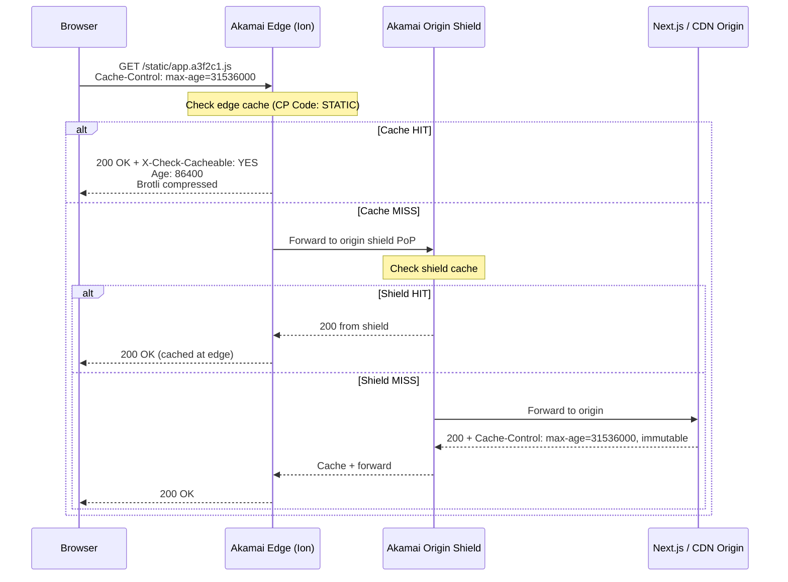
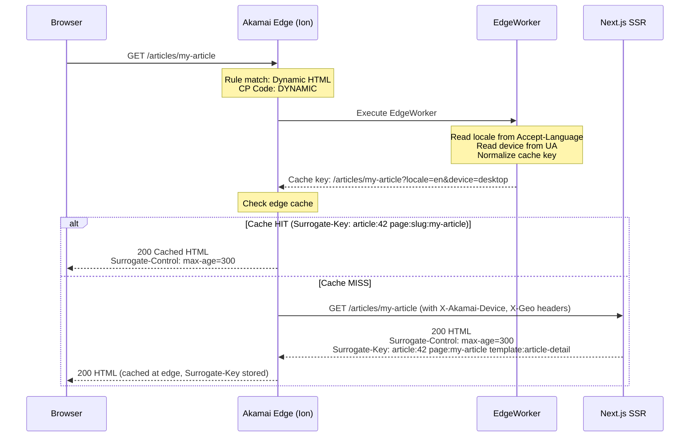
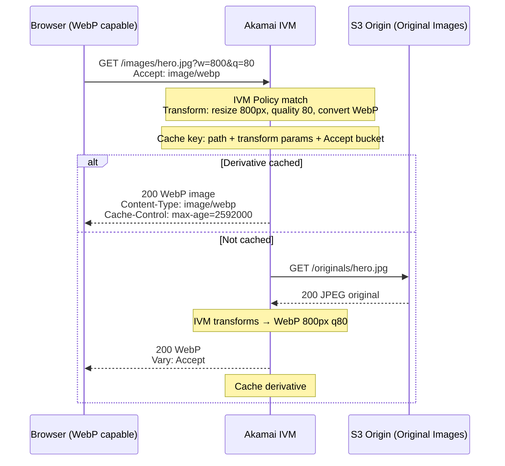
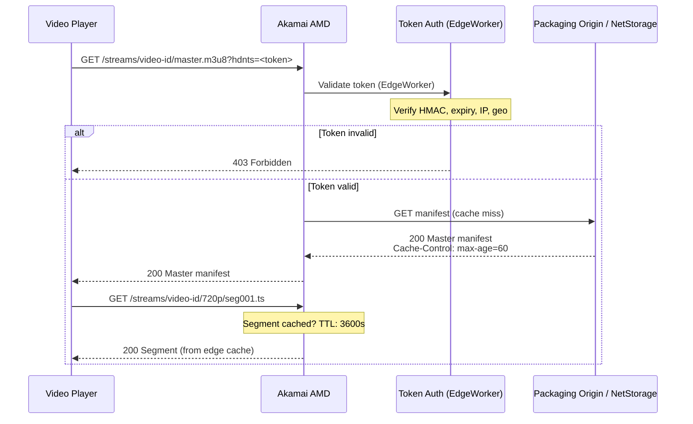
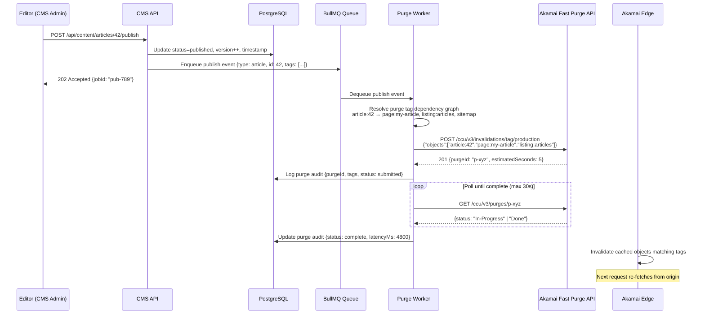
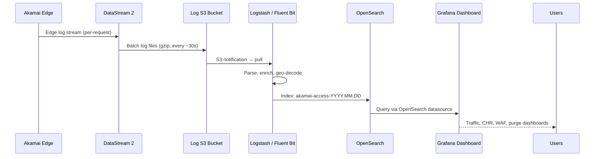

# High-Level Architecture

## System Context Diagram

```mermaid
graph TB
    subgraph Users["End Users & Clients"]
        Browser["Browser / Mobile"]
        VideoPlayer["Video Player (HLS/DASH)"]
        Partner["Partner API Client"]
    end

    subgraph Editors["Content Team"]
        CMSAdmin["CMS Admin Console"]
        PreviewBrowser["Preview Browser"]
    end

    subgraph AkamaiEdge["Akamai Edge Network (Global PoPs)"]
        direction TB
        WAF["App & API Protector (WAF/DDoS/Bot)"]
        Ion["Ion (Static + Dynamic Delivery)"]
        AMD["Adaptive Media Delivery (Streaming)"]
        IVM["Image & Video Manager"]
        EW["EdgeWorkers (Edge Logic)"]
        EKV["EdgeKV (Edge Config Store)"]
        DS2["DataStream 2 (Edge Logging)"]
        FP["Fast Purge API"]
    end

    subgraph OriginCluster["Origin Cluster (Protected by Site Shield)"]
        direction TB
        LB["Load Balancer (nginx/HAProxy)"]
        WebFront["Next.js Frontend (SSR/ISR)"]
        CMSAPI["CMS API (NestJS)"]
        AdminAPI["Admin API (Internal Only)"]
        PurgeWorker["Purge Worker"]
        PublishWorker["Publish Worker"]
        ReportWorker["Reporting Worker"]
    end

    subgraph DataLayer["Data Layer"]
        PG["PostgreSQL 16 (Primary + Replica)"]
        Redis["Redis 7 Cluster"]
        S3["S3 Object Storage (Media/Assets)"]
        OS["OpenSearch (Search + Logs)"]
        Queue["BullMQ / Redis Queues"]
    end

    subgraph ObsStack["Observability Stack"]
        OTel["OpenTelemetry Collector"]
        Prom["Prometheus"]
        Graf["Grafana"]
        OSLogs["OpenSearch (Logs/Analytics)"]
        Alerts["Alertmanager / PagerDuty"]
    end

    subgraph CICD["CI/CD Pipeline"]
        GHA["GitHub Actions"]
        AkamaiStaging["Akamai Staging Network"]
        Registry["Container Registry"]
    end

    Browser -->|HTTPS| WAF
    VideoPlayer -->|HTTPS HLS/DASH| AMD
    Partner -->|HTTPS API| WAF
    WAF --> Ion
    WAF --> AMD
    WAF --> IVM
    Ion --> EW
    EW --> EKV
    Ion -->|Cache Miss| LB
    AMD -->|Cache Miss| LB
    IVM -->|Transform Request| S3
    LB --> WebFront
    LB --> CMSAPI

    CMSAdmin -->|HTTPS (IP Allowlist + MFA)| AdminAPI
    PreviewBrowser -->|Preview Token| CMSAPI

    CMSAPI --> PG
    CMSAPI --> Redis
    CMSAPI --> S3
    CMSAPI --> OS
    CMSAPI --> Queue
    WebFront --> CMSAPI
    WebFront --> Redis

    Queue --> PublishWorker
    Queue --> PurgeWorker
    Queue --> ReportWorker
    PurgeWorker -->|Fast Purge API| FP
    FP --> Ion

    DS2 -->|Edge Logs| OSLogs
    OTel --> Prom
    OTel --> OSLogs
    Prom --> Graf
    Graf --> Alerts

    GHA --> Registry
    GHA --> AkamaiStaging
    AkamaiStaging -->|Validated| AkamaiEdge
```

---

## Request Flow: Static Content



**Static Content Cache Key:**
- Scheme + Host + Path
- No query string (stripped for immutable assets)
- No cookies
- Vary: Accept-Encoding (handled by Akamai transparent compression)

---

## Request Flow: Dynamic Content (SSR Page)



**Dynamic Page Cache Key:**
- Scheme + Host + Path
- Normalized query string (allowlist: `page`, `sort`, `filter`)
- Stripped cookies (allowlist: none for public pages)
- Vary: Accept-Language header mapped to locale bucket
- Device group (desktop/mobile/tablet) from UA normalization

---

## Request Flow: Image Optimization



---

## Request Flow: Video Streaming (VOD HLS)



---

## Request Flow: Content Publishing and Cache Purge



---

## Request Flow: Reporting and Logging



---

## Network Zones

```
┌─────────────────────────────────────────────────────────────┐
│  PUBLIC INTERNET                                            │
│  Users → Akamai Edge PoPs (2000+ globally)                  │
└──────────────────────┬──────────────────────────────────────┘
                       │ Akamai SureRoute / Site Shield IPs only
┌──────────────────────▼──────────────────────────────────────┐
│  DMZ / ORIGIN NETWORK                                       │
│  Firewall allows only Akamai Site Shield IP ranges          │
│  Load Balancer → App Servers                                │
└──────────────────────┬──────────────────────────────────────┘
                       │ Private network
┌──────────────────────▼──────────────────────────────────────┐
│  PRIVATE DATA ZONE                                          │
│  PostgreSQL, Redis, S3, OpenSearch                          │
│  No public ingress                                          │
└─────────────────────────────────────────────────────────────┘
                       │ VPN / Bastion only
┌──────────────────────▼──────────────────────────────────────┐
│  ADMIN ZONE                                                 │
│  CMS Admin Console: IP allowlist + SSO/MFA + VPN            │
└─────────────────────────────────────────────────────────────┘
```
